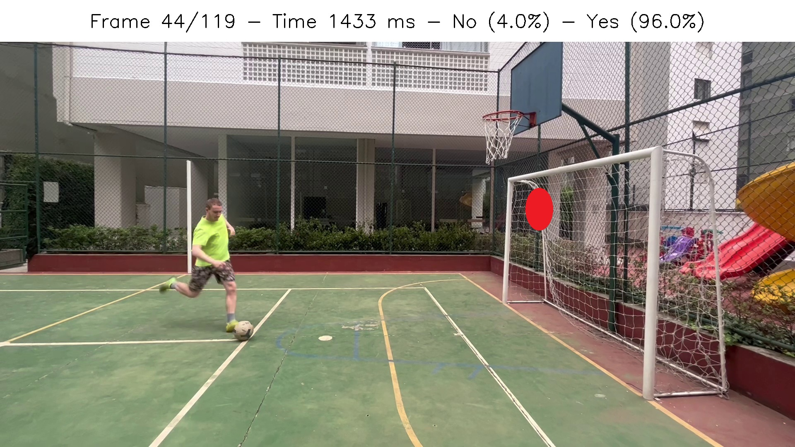

# Abstract
Development of a digital device, with computer vision, sensors and associated electronics, to capture the moment in  which the player positions himself to kick the penalty and randomly indicate a position in the goal where he should direct his kick

# Desired Output


# Folder Structure
```
.
├── data                    # Data for training and testeing 
├── docs                    # Documentation files
├── models                  # Based and trained models
├── notebooks               # Notebooks for developing the models and main code
├── requirements.txt
├── requirements_windows.txt
└── README.md
```